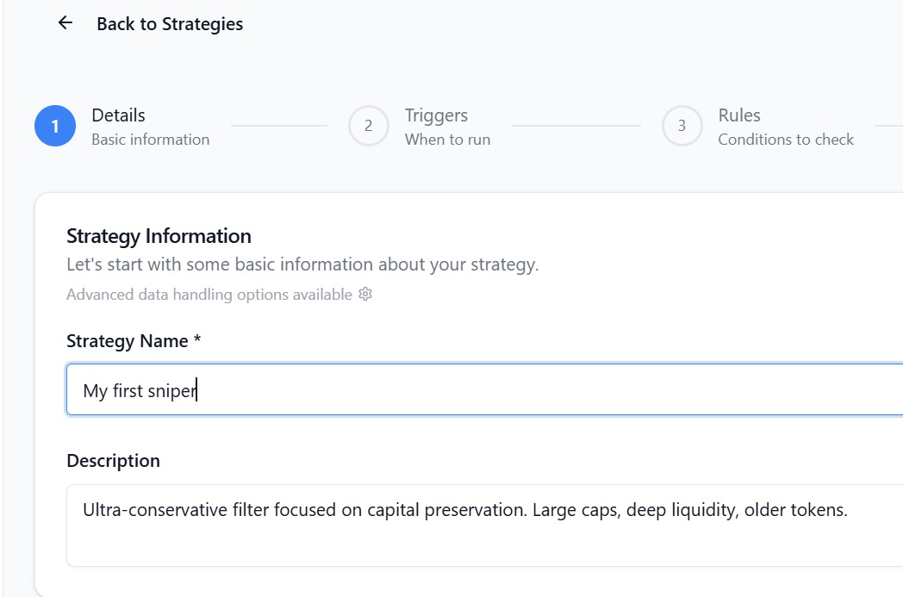

This guide is for traders who want value now. You'll connect, activate a battle‑tested strategy, and receive alerts in Telegram.

<Steps>
  <Step title="Login using telegram">
    Your account is created by signing in using telegram

    1. Open the app: `https://app.MemePerfect.io`
    2. Click `Continue with telegram`

        

       
    3. This will open telegram on your device with the start of the bot showing the welcome message.
    5. A login message will come up with a URL to click, which will load the app 

    

    <Check>
      Dashboard is active after signing.
    </Check>
  </Step>
  <Step title="Clone a Safe Launch strategy">
    Start with a template designed to filter scams and low‑effort launches.

    1. Click `+ Create New Strategy` 
    2. Select template: "Fort Knox (Max Safety)"
    3. Name it (e.g., "My First Sniper") and \`Save Strategy 
    4. On the Strategies page, click `Activate` 

    <Info>
      Template includes essential Dealbreakers (honeypot, taxes, mint authority).
    </Info>
  </Step>
  <Step title="Receive alerts on telegram">
    1. Go to `telegram`  now and you shoudl be able to find alerts that meet the criteria of your strategy 
    2. Click on the address to copy it to any trading app of your choice
    3. Or you can click the link to most common platform like axiom, nova, bonkbot and dextools 
  </Step>
</Steps>

### You're ready

Your strategy is live and monitoring. You'll get actionable alerts for legitimate, high‑potential launches.

<Card title="Next: Core Concepts" icon="book-open" href="/core-concepts/what-is-a-strategy">
  
</Card>